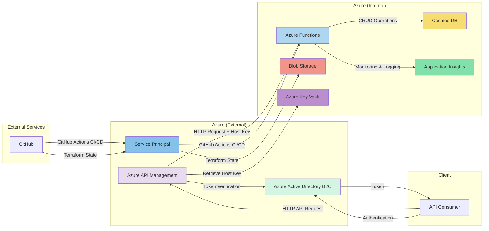

# Proposed System Architecture Diagram

## Appendix 1: Azure System Architecture Diagram Using Mermaid

### Visual Representation

<figure><figcaption>
Vehicle Data Management System Architecture Diagram
</figcaption></figure>

### Mermaid Source Code

