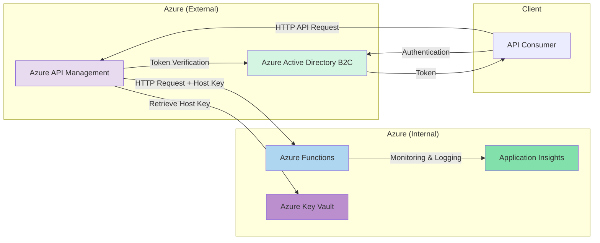

# Simplified Network Request Diagram

## Appendix 2: Simplified Network Request Diagram Using Mermaid

### Visual Representation

<figure><figcaption>
A subsection of the proposed system architecture diagram focusing on network requests initiated by the user.
</figcaption></figure>

The full proposed system architecture diagram is featured on the [Proposed System Architecture Diagram wiki page](../solution-design/system-architecture.md)[.](proposed-system-architecture-diagram.md)

### Mermaid Source Code

